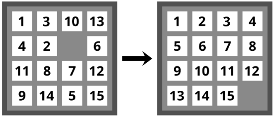

# 15-Puzzle

This is a challenge from [The C# Player's Guide by RB Whitaker, 5e](https://csharpplayersguide.com/). It is from Level 24 *The Catacombs of the Class* focusing on gaining practice creating classes and doing object-oriented design.

Below is the challenge description:

## ⚔ Boss Battle: 15-Puzzle [150 XP]
The second pedestal requires you to provide an object-oriented design for the game of 15-Puzzle.

The game of 15-Puzzle contains a set of numbered tiles on a board with a single open slot. The goal is to rearrange the tiles to put the numbers in order, with the empty space in the bottom-right corner.
- The player needs to be able to manipulate the board to rearrange it.
- The current state of the game needs to be displayed to the user.
- The game needs to detect when it has been solved and tell the player they won.
- The game needs to be able to generate random puzzles to solve.
- The game needs to track and display how many moves the player has made.

**Objectives**:
- Use CRC cards (or a suitable alternative) to outline the objects and classes that may be needed to make the game of 15-Puzzle. **You do not need to create this full game; just come up with a potential design as a starting point**.
- **Answer this question**: Would your design need to change if we also wanted 3x3 or 5x5 boards?
***

The included markdown file [solution.md](solution.md) is my solution to this challenge. The author's solution is available here: [24 15-Puzzle - Solutions 5th Edition | The C# Player's Guide](https://csharpplayersguide.com/solutions/5th-edition/fifteen-puzzle).
