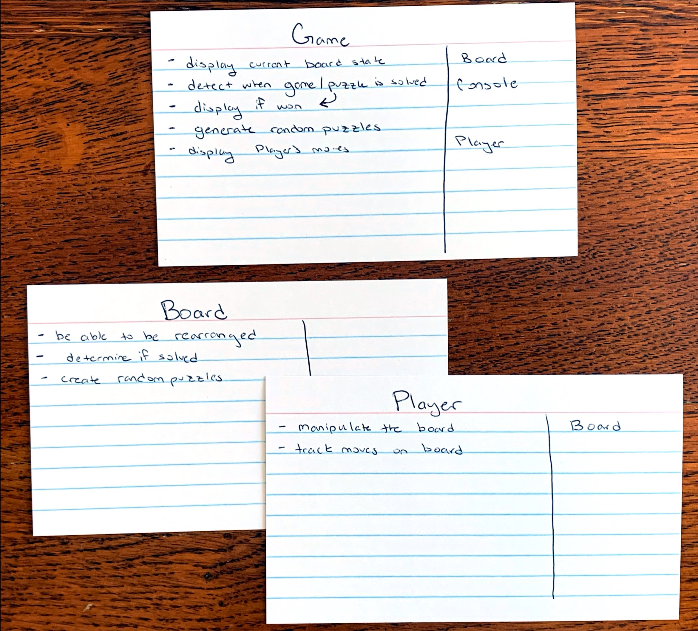
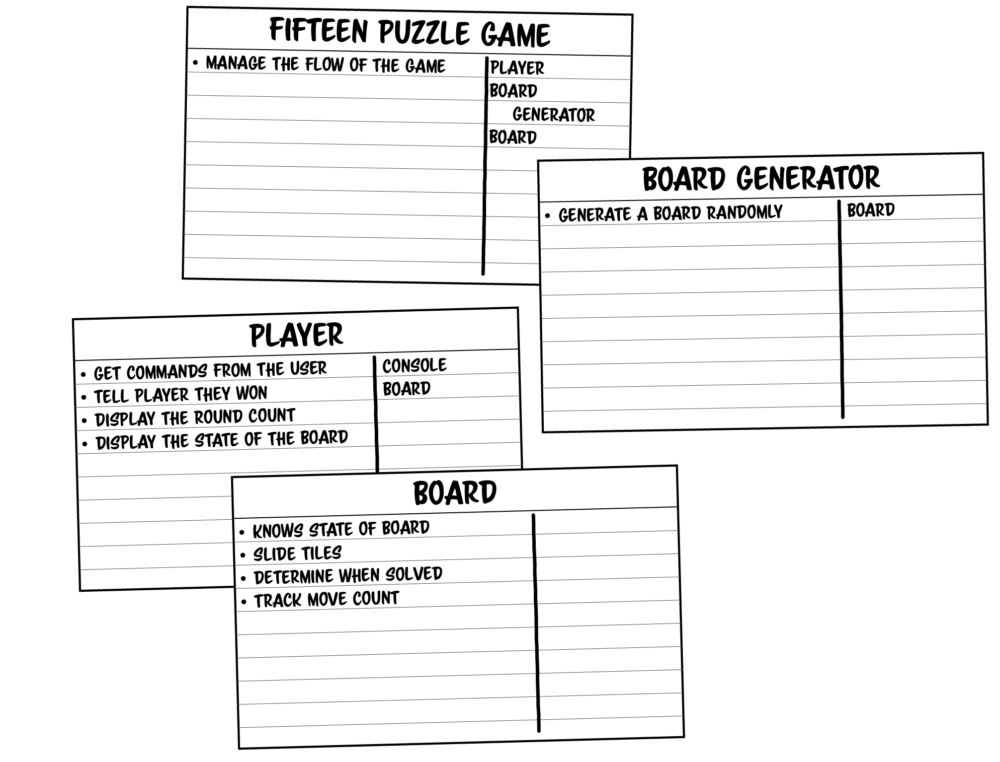

# Solution: 15-Puzzle

To solve this problem, I am going to refer to and follow the steps shown in the previous level of the book, Level 23 *Object-Oriented Design*, that includes *requirement gathering*, *noun extraction*, and using *CRC cards* as a tool to think through the design process.

## Requirement Gathering

The [challenge description](README.md#-boss-battle-15-puzzle-150-xp) provides us with a list of requirements that I am to design around. They are:
- The player needs to be able to manipulate the board to rearrange it.
- The current state of the game needs to be displayed to the user.
- The game needs to detect when it has been solved and tell the player they won.
- The game needs to be able to generate random puzzles to solve.
- The game needs to track and display how many moves the player has made.

From this list of requirements, I should be able to create a good design for the challenge.

## Noun Extraction

I will use noun and verb extraction to create a good idea of what objects and jobs those objects should do. I am purposefully going to try to keep everything in this section vauge, but will mention specific implementation details if it helps to better describe something.

### Requirement 1

> The player needs to be able to manipulate the board to rearrange it.

*Player*: Noun - The user of the program. Can represent an object and/or class of things the user can do/how they interact with the program.

*Board*: Noun - An object and/or class; the board of the 15-Puzzle game.

*Manipulate*: Verb - An action the *Player* needs to be able to do to the *Board*.

*Rearrange*: Verb - An action of something that happens to the *Board* after the *Player* *manipulates* it.

It seems like there are two possible classes that can be made from this requirement, one to represent the user (the *Player* class), and one to represent the puzzle (the *Board* class). The user (*Player*) will need to be able to interact with the puzzle (*Board*) by *Manipulating/Rearranging* it, which can be different actions/methods of each class.

### Requirement 2

> The current state of the game needs to be displayed to the user.

*Game*: Noun - An object and/or class; can track other objects/classes in program.

*Display*: Verb - An action the *Game* needs to do to show the user what is happening currently.

This introduces a very clear function that the program will need to do. The program will need some way to show the user what is currently going on in the game, which can be displayed similarly to the image in the challenge description. There should be a *Game* class that tracks the current states of the program to be able to perform the *Display* action.

### Requirement 3

> The game needs to detect when it has been solved and tell the player they won.

*Game*: Noun - An object and/or class; needs to track state of other objects/classes to determine win-state.

*Player*: Noun - An object and/or class representing the user and their actions.

*Detect*: Verb - An action the *Game* will need to do.

*Solved*: Verb - A state(?) the *Game* and/or *Board* could be in.

*Won*: Verb - A state(?) the *Game* and/or *Board* could be in.

This requirement introduces another functionality of the *Game* class that it will need to do, separate from the *Board* class, which is checking if the puzzle is solved and communicating that information to the user.

### Requirement 4

> The game needs to be able to generate random puzzles to solve.

*Game*: Noun - An object and/or class; discussed previously.

*Generate*: Verb - An action the *Game* needs to do; create different puzzles (*Board*) that are random.

This requirement introduces another functionality of the *Game* class; the ability to *Generate* new and random puzzles (*Board*).

### Requirement 5

> The game needs to track and display how many moves the player has made.

*Game*: Noun - An object and/or class; discussed previously.

*Player*: Noun - An object and/or class; discussed previously.

*Track*: Verb - An action the *Game* will need to do; remember actions of the *Player* on the *Board*.

*Display*: Verb - An action the *Game* will need to do; different than the previously seen *Display* verb. This is in relation to the *Track* verb that the *Game* will need to show to the user.

## CRC Cards

Now that I've looked more closely at the requirements of the problem, it is time to work with *class-responsibility-collaborator cards* to try to create a design for this problem. The results of my design are below:

The book's author has the following solution to this challenge:

### Comparing CRC Cards

When comparing the author's solution to my solution, I notice the following key differences:
- I had the job of displaying to the console handled by the *Game* class, where the author's solution has this job as part of the *Player* class.
- The author as a fourth *Board Generator* class with the function of creating random boards. I kept this functionality as part of the *Board* class itsef.
    - I was thinking it could be a static methods in the class that invokes the constructor using some random values, but this could be unclear with the current CRC cards and would benefit from some sample code to clarify it.
- I had the job of tracking the board moves as part of the *Player* class, whereas the author had it as part of the *Board* class. Having it there instead makes more sense because it is a concept tightly connected to the specific board implementation and not of the player.

## Challenge Question:
*From challenge description: [Answer this question](README.md#-boss-battle-15-puzzle-150-xp)*

> Would your design need to change if we also wanted 3x3 or 5x5 boards.

No, the design would not need to change if we wanted different size boards, but the implementation on certain things might become more complex, specifically the generation of random puzzles.
