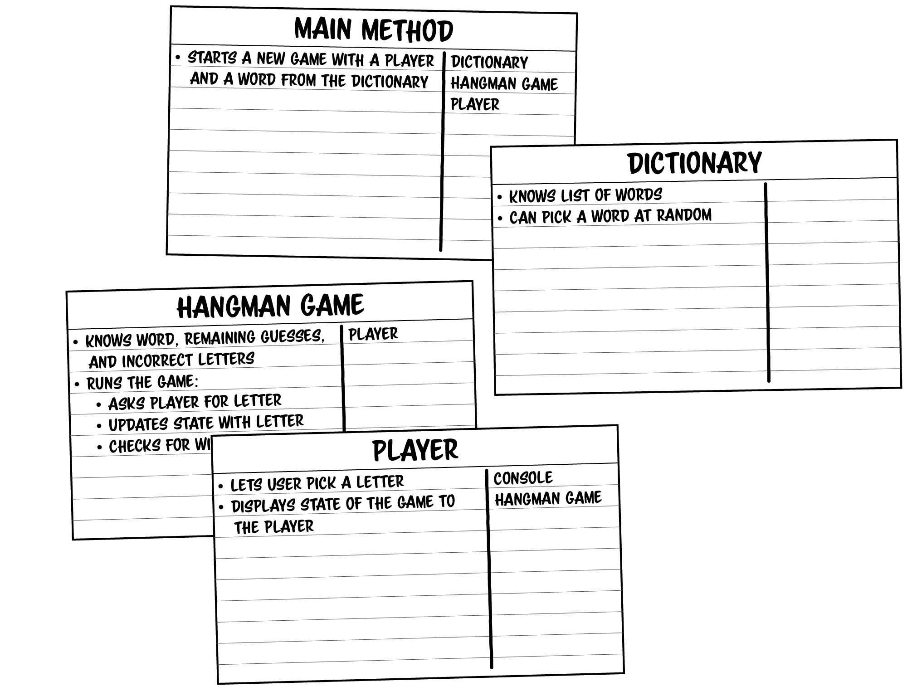

# Solution: Hangman

To solve this problem, I am going to refer to and follow the steps shown in the previous level of the book, Level 23 *Object-Oriented Design*, that includes *requirement gathering*, *noun extraction*, and using *CRC cards* as a tool to think through the design process.

## Requirement Gathering

The [challenge description](README.md#-boss-battle-hangman-150-xp) provides us with a list of requirements that I am to design around. They are:
- The game picks a word at random from a list of words.
- The game's state is displayed to the player, as shown above.
- The player can pick a letter. If they pick a letter they already chose, pick again.
- The game should update its state based on the letter the player picked.
- The game needs to detect a win for the player (all letters have been guessed).
- The game needs to detect a loss for the player (out of incorrect guesses).

From this list of requirements, I should be able to create a good design for the challenge.

## Noun Extraction

I will use noun and verb extraction to create a good idea of what objects and jobs those objects should do. I am purposefully going to try to keep everything in this section vauge, but will mention specific implementation details if it helps to better describe something.

### Requirement 1

> The game picks a word at random from a list of words.

*Game*: Noun - an object and/or class to track and run important game functions.

*List*: Noun - an object and/or class to get words from. 

*Picks*: Verb - an action the game will need to do.

This first requirement tells how the program will select the word to use for the game.

### Requirement 2

> The game's state is displayed to the player, as shown above.

*Game*: Noun - an object and/or class to track and run important game functions.

*Player*: Noun - an object and/or class to handle user interactions with the program.

*Display*: Verb - an action the game will need to do to show the user what is currently happening.

This requirement introduces ideas for how the user will interact with the game and what methods/actions the game will need to support.

### Requirement 3

> The player can pick a letter. If they pick a letter they already chose, pick again.

*Player*: Noun - an object and/or class to handle user interactions with the program.

*Letter*: Noun - an object and/or class defining what the user can choose run (i.e. `char`s including `A-Z`, `a-z`).

*Pick*: Verb - an action the player can do in the game, includes extra functionality information.

This requirement continues to describe how the user can interact with the game.

### Requirement 4

> The game should update its state based on the letter the player picked.

*Game*: Noun - an object and/or class to track and run important game functions.

*Player*: Noun - an object and/or class to handle user interactions with the program.

*Update*: Verb - an action the game should do based on user interaction.

This requirement indicates that the game should change based on the previously mentioned user interactions.

### Requirement 5

> The game needs to detect a win for the player (all letters have been guessed).

*Game*: Noun - an object and/or class to track and run important game functions.

*Win*: Noun - a potential state the game can be in. Defined by "all letters have been guessed".

*Player*: Noun - an object and/or class to handle user interactions with the program.

*Detect*: Verb - an action the game needs to do to be able to determine the *Win* state.

This requirement introduces the concept of what a game "win" is and what defines it.

### Requirement 6

> The game needs to detect a loss for the player (out of incorrect guesses).

*Game*: Noun - an object and/or class to track and run important game functions.

*Loss*: Noun - a potential state the game can be in. Defined by "out of incorrect guesses".

*Player*: Noun - an object and/or class to handle user interactions with the program.

*Detect*: Verb - an action the game needs to do to be able to determine the *Loss* state.

This requirement introduces the concept of what a game "loss" is and what defines it.

## CRC Cards

Now that I've looked more closely at the requirements of the problem, it is time to work with *class-responsibility-collaborator cards* to try to create a design for this problem. Note that the way I was describing the nouns and verbs in the requirements was different than in the previous challenges because I am beginning to understand more of how the requirements translate to CRC cards, what information is important, and what is not. When creating the CRC cards for this challenge, I was referring back to my CRC cards for the previous challenge [15 Puzzle](../FifteenPuzzle/solution.md) to review what differences my solution had with the author's solution, focusing on how they were different and how I could improve my design.

The results of my design are below:

The book's author has the following solution to this challenge:

### Comparing CRC Cards

When comparing the author's solution to my solution, I notice the following key differences, with some similar to my differences in [15 Puzzle](../FifteenPuzzle/solution.md#comparing-crc-cards):
- In my solution, the *HangmanGame* (or *Main Method*) interacts with the *Player* and the game *Hangman*, they do not interact with each other. The author has the *Main Method* setting everything up, and the game *Hangman Game* (I called this *Hangman*) interacts with the *Player*.
- In my solution, I let the game *Hangman* handle displaying the game, because it had all the information about the current game state, and asking the user for a letter is handled in the *Player* class. The author's solution left the displaying to the *Player* class -- i.e. everything user facing (displaying information and handling user interactions) was handled in the *Player* class. 
    - I can already see an issue with my implementation, being that the game display shown in the [challenge description](README.md#-boss-battle-hangman-150-xp) would be hard and messy to recreate this way, because both of my *Player* and *Hangman* classes are printing information. Having one class handle all `Console` interactions is cleaner and easier to manage.
    - I could change this to be done all in the main method, where that class would be calling both the *Player* and *Hangman* classes to get all the information it needs to print.

At the current scope and scale of the challenge, I think both my design (with some/all of the above notes on modifications) and the authors design *can* work, because it is a small application. Which one is better would be more clear once it is actually implemented in code.
