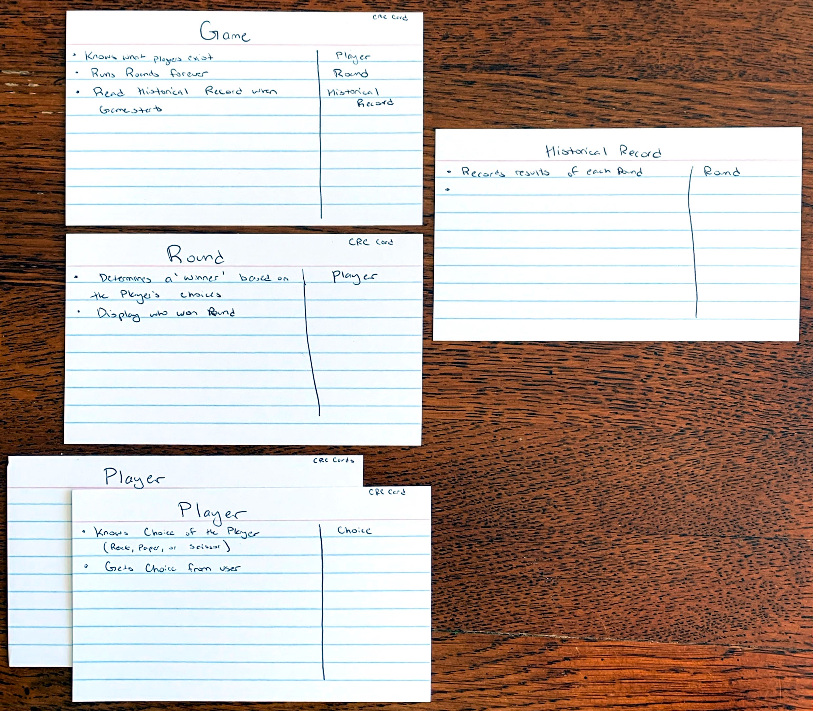

# Solution: Rock-Paper-Scissors

To solve this problem, I am going to refer to and follow the steps shown in the previous level of the book, Level 23 *Object-Oriented Design*, that includes *requirement gathering*, *noun extraction*, and using *CRC cards* as a tool to think through the design process.

## Requirement Gathering

The [challenge description](README.md#-boss-battle-rock-paper-scissors-150-xp) provides us with a list of requirements that I am to design around. They are:
- Two human players compete against each other.
- Each player picks Rock, Paper, or Scissors.
- Depending on the players' choices, a winner is determined: Rock beats Scissors, Scissors beats Paper, Paper beats Rock. If both players pick the same option, it is a draw.
- The game must display who won the round.
- The game will keep running rounds until the window is closed but must remember the historical record of how many times each player won and how many draws there were.

From this list of requirements, I should be able to create a good design for the challenge.

## Noun Extraction

I will use noun and verb extraction to create a good idea of what objects and jobs those objects should do. I am purposefully going to try to keep everything in this section vauge, but will mention specific implementation details if it helps to better describe something.

### Requirement 1

> Two human players compete against each other.

*Players*: A noun for a potential class that the problem will need.

*Compete*: A verb for something the *Player* class will need to do.

From this first requirement, we might want a *Player* class that will have instances that will represent each of the two human players. This class will need to be able to *compete* against other *Player* classes in the game.

### Requirement 2

> Each player picks Rock, Paper, or Scissors.

*Player*: A noun for a potential class; also mentioned in the previous requirement.

*Rock, Paper, Scissors*: These nouns represent categories that the *Player* class will need to choose. At first glance, they could be an enumeration:
```csharp
public enum Choice { Rock, Paper, Scissors };
```

### Requirement 3

> Depending on the players' choices, a winner is determined: Rock beats Scissors, Scissors beats Paper, Paper beats Rock. If both players pick the same option, it is a draw.

*Player*: A noun for a potential class; also mentioned in the previous requirements.

*Choices*: A noun representing multiple things the *Player* class will select from; from the previous requirement, this could be the *Choice* enumeration we made.

*Winner*: A noun for a game-state concept. Could apply to describe the *Player* class, or some other game management class.

*Rock, Paper, Scissors*: A collection of nouns that represent the possible *choices* in the *Choice* enumeration.

*Beats*: A verb for how the *Choice* enumeration and the two *Player* instances will interact with each other to determine which *Player* is the *Winner*. 

*Draw*: A noun for a game-state concept. Could apply similarly like the *Winner* concept to describe the *Player* class, or some other game management class.

There are many nouns and verbs in this requirement that describe how the game is played, and what objects will be needed to play the game. It introduces new nouns that determine what the outcome of the game between two *Players* will be (*Winner*, *Draw*), and expands on the *Choice* enumeration and how that might be used (as well as making the idea of using an enumeration sound like the right choice for this application).

### Requirement 4

> The game must display who won the round.

*Game*: A noun for a potential class. 

*display who won*: A verb for something the *Game* class will need to do. The *who* part indicates it will need information about the current state of the class to determine its output (from *Player* class intances?).

*Round*: A noun for a game-state concept, class, or object. Not directly mentioned earlier, but *Players* will make their *Choice* in a *Round*, and that will determine *who won* the *Round*.

This requirement introduces the idea of a *Round* class or object that I could use as a way to track the *Choice* of each *Player* and determine the *Winner*. It starts to create ideas of collaboration between the different objects and classes of the problem. 

### Requirement 5

> The game will keep running rounds until the window is closed but must remember the historical record of how many times each player won and how many draws there were.

There are a lot of nouns and verbs in this requirement:
- Nouns: *game*, *round*, *window*, *historical record*, *player*, along with some other's we've mentioned for game-state concepts.
- Verbs: *running*, *closed*, *remember*

*Game*, *Round*, and *Player*: Nouns for potential classes and/or objects discussed in previous requirements.

*Historical Record*: A noun for a potential class or object; it will be a way for the program to have a persistent memory. 

*Window*: A noun; How the game is displayed to the users/players, will be a console application window (based on context from the book -- only been dealing with console applications).

*Running*: A verb used in relation to the *Round* object, a way for the program to play a round multiple times. This seems like an action that the *Game* would perform in relation to how it interacts with the *Round*.

*Closed*: A verb for something that happens to the *Window*. Ending the program.

*Remember*: A verb for an action that the program will need to do after it is *closed*; it will need to *remember* the *historical record*. The *Game* could have a *remember* method when it starts to load information from the *historical record*.

As a note, the ideas and concepts of working with persistent memory (i.e. reading/writing from a file) have not been covered up to this point in the book, so I will not be going into any detail around that as I consider it outside the scope of the challenge.

## CRC Cards

Now that I've looked more closely at the requirements of the problem, it is time to work with *class-responsibility-collaborator cards* to try to create a design for this problem. The results of my design are below:



